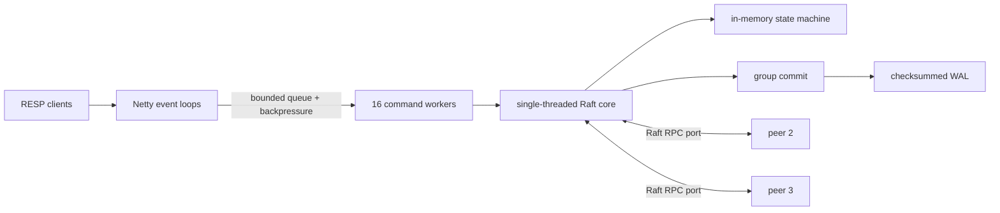

# RaftKV

[](https://openjdk.org/projects/jdk/21/)
[](LICENSE)

RaftKV is a compact distributed key-value store built in Java 21. It exposes a
binary-safe RESP2 interface over Netty and replicates mutations through Raft to
a durable write-ahead log. The project focuses on the systems work behind a
small database: non-blocking network I/O, bounded concurrency, explicit
backpressure, leader election, linearizable reads, quorum durability, crash
recovery, and group commit.

> This is an educational systems project, not a drop-in Redis replacement or a
> production database. See [Limitations](#limitations) before using it outside
> a local or experimental environment.

## Highlights

- Netty NIO RESP server with fragmented-request and pipelining support.
- A bounded 16-thread command pool by default; event loops do not perform disk
  or consensus work.
- Read and write watermarks pause socket reads when queues or outbound buffers
  are saturated.
- Leader-only `GET`, `SET`, and `DEL`; reads use a quorum confirmation and
  mutations complete only after the entry is durable on a majority and applied
  by the leader.
- Checksummed WAL recovery, torn-tail truncation, persisted Raft metadata, and
  configurable group commit (64 entries or 2 ms by default).
- Static three-node Docker Compose cluster, Java 21 CI, failure-oriented JUnit
  tests, and a dependency-free RESP benchmark harness.

## Architecture



Netty decodes RESP on a small event-loop group and hands typed commands to a
bounded executor. Per-connection responses remain ordered even when command
futures complete out of order. A single-threaded Raft core owns consensus state;
disk work is batched separately, so socket and consensus threads are not blocked
on `fsync`.

Successful mutations have been appended durably by a majority of the configured
members and applied on the leader. A leader `GET` confirms contact with a
majority in its current term before reading the applied state machine. Followers
reject data commands rather than serving potentially stale values. `PING` and
`ECHO` are node-local health commands.

For protocol flow, storage details, and concurrency boundaries, see
[Architecture](docs/ARCHITECTURE.md). For exact guarantees under failure, see
[Consistency and failure semantics](docs/FAILURE-SEMANTICS.md).

## Quick start: three nodes

Requirements: Docker with Compose v2. No local Java or Redis installation is
needed for the cluster itself.

```bash
./scripts/cluster.sh up
./scripts/smoke.sh
```

Compose exposes the three RESP endpoints on `127.0.0.1:6379`, `:6380`, and
`:6381`. The smoke test waits for an election, discovers the writable leader,
then verifies `PING`, a quorum-backed `SET`, and `GET`. Startup normally takes
less than the smoke test's 30-second deadline.

The cluster has persistent named volumes. `./scripts/cluster.sh down` removes
containers and the private network but deliberately preserves those volumes.
Run `./scripts/cluster.sh help` for the lifecycle commands. Host ports and the
image name can be changed with [the example environment file](config/cluster.env.example).

## RESP examples

Any RESP2 client can connect. With `redis-cli`, first inspect all nodes to find
the one reporting `role:leader`:

```bash
for port in 6379 6380 6381; do
  echo "--- :${port}"
  redis-cli -p "${port}" RAFT.INFO
done
```

Then send data commands to that leader (replace `6379` if necessary):

```bash
redis-cli -p 6379 PING
redis-cli -p 6379 SET user:42 "Ada"
redis-cli -p 6379 GET user:42
redis-cli -p 6379 DEL user:42
redis-cli -p 6379 GROUP.STATS
```

The supported command surface is intentionally small:

| Command | Scope | Response |
| --- | --- | --- |
| `PING [message]` | Local | `PONG` or the supplied message |
| `ECHO message` | Local | Bulk string |
| `GET key` | Leader, quorum-confirmed | Bulk string or null |
| `SET key value` | Leader, quorum-durable | `OK` |
| `DEL key [key ...]` | Leader, quorum-durable | Number removed |
| `INFO` / `RAFT.INFO` | Local | Raft status |
| `GROUP.STATS` | Local | Group-commit counters |

Data commands sent to a follower return a RESP error with the known leader ID,
if available. The server does not proxy or redirect the connection; clients must
select the leader and retry. Because an error or lost connection can race with a
commit, only retry idempotent operations automatically.

## Build and run without Docker

Build and test with Maven 3.9+ and JDK 21:

```bash
mvn --batch-mode verify
java -jar target/raftkv.jar --help
```

Use a distinct client port, Raft port, and data directory for every process on
one machine. Every node receives the same full membership string, including
itself:

```bash
MEMBERS="1=127.0.0.1:7001,2=127.0.0.1:7002,3=127.0.0.1:7003"

java -jar target/raftkv.jar --node-id=1 --client-port=6379 --raft-port=7001 \
  --data-dir=data/node-1 --peers="${MEMBERS}"
java -jar target/raftkv.jar --node-id=2 --client-port=6380 --raft-port=7002 \
  --data-dir=data/node-2 --peers="${MEMBERS}"
java -jar target/raftkv.jar --node-id=3 --client-port=6381 --raft-port=7003 \
  --data-dir=data/node-3 --peers="${MEMBERS}"
```

The commands above run in the foreground; use separate terminals. Node IDs are
part of durable identity. Never point two processes at the same data directory
or reuse an existing directory for a different node ID.

## Consistency and failure behavior

A three-member cluster can continue after one node becomes unavailable. After a
leader failure, writes and linearizable reads fail during the election window;
clients reconnect to the new leader and retry operations whose outcome is known
to be safe. With fewer than two reachable healthy members, the cluster cannot
confirm new reads or commit mutations. Local `PING`, `ECHO`, and status commands
can still answer.

An acknowledged mutation survives the loss of any one member because the
leader responds only after a majority has durably appended and the leader has
applied the entry. An unacknowledged mutation may later appear or disappear:
the client may have lost its response after commit, or the old leader may have
failed before commit. Applications that need exactly-once effects must add
request IDs or another deduplication scheme above this API.

On restart, a node verifies WAL frames and rebuilds the in-memory state machine
from committed entries. A torn final frame is removed; corruption in an earlier
frame fails recovery instead of silently skipping data. See the
[failure-semantics document](docs/FAILURE-SEMANTICS.md) for the full matrix.

## Recorded benchmark results

The following are **reference measurements supplied with the project brief**.
They have not been reproduced by this repository's CI, and the original
hardware, payload size, run length, and commit SHA were not provided. Treat them
as historical project results—not a performance guarantee.

| Workload | Topology / durability | Concurrency | Throughput | Latency |
| --- | --- | ---: | ---: | ---: |
| `GET` | Netty RESP server; topology not recorded | 50 clients | 84.7K ops/s | 0.55 ms p50 |
| `SET` | 3 Raft nodes; quorum-durable | Not recorded | 924 ops/s | Not recorded |

In a separately supplied single-node comparison, group commit improved write
throughput by **8.4×** and reduced p99 latency by **85.8%** relative to the
unbatched baseline. The exact workload and environment were not recorded, so
the comparison should not be generalized beyond that run.

To produce a fully attributed CSV on your machine:

```bash
./scripts/smoke.sh                         # note the leader port
RAFTKV_BENCH_PORT=6379 ./bench/run.sh      # replace with that port
```

The standard-library Python driver records operation, endpoint, client count,
duration, keyspace, value size, successes, errors, ops/s, p50, p95, p99, UTC
timestamp, and commit SHA. Read [Benchmarking](docs/BENCHMARKS.md) before
comparing results; the driver uses one in-flight request per connection and may
itself become the bottleneck.

## Tests

```bash
mvn --batch-mode verify
```

The JUnit suite covers RESP framing and limits, command validation, backpressure
and response ordering, WAL recovery/corruption handling, group-commit behavior,
Raft election and replication, linearizable reads, and failover behavior. CI
runs the suite on Java 21, checks the helper scripts, and builds the container;
it intentionally does not publish or validate the reference benchmark numbers.

## Limitations

- Static membership only; there is no joint-consensus reconfiguration.
- One Raft group and one in-memory keyspace; there is no sharding.
- No snapshots or log compaction, so restart time and WAL size grow with writes.
- No authentication, authorization, TLS, encryption at rest, or multi-tenancy.
- RESP2 subset only: no transactions, scripts, expirations, pub/sub, streams,
  secondary indexes, or Redis Cluster protocol.
- No transparent leader discovery, request deduplication, or exactly-once API.
- Docker Compose is a local demonstration, not a production deployment model.

## License

Licensed under the [Apache License 2.0](LICENSE).
